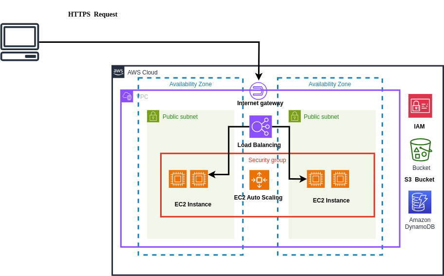

<h2 align="center">EC2 autoscaling with boto3</h2>

In this personal project, I used the AWS SDK (Python boto3) to automate the deployment of a 3-tier web application on AWS. The aim of this project is to explore the boto3 library for Iac and also develop templates for AWS resource automation for test and production environments, so feel free to modify and use this code for test and production 🙂.

The project template creates a VPC with a load balancer targeting an autoscaling group of EC2 instances in different availability zones. The EC2 instances serving the web application communicate with Amazon S3 and DynamoDB.

How to use:
-----------
cd into the cloned directory and run the following python scripts

1.  python create_db_s3.py

- Create IAM service role, this will allow AWS services such as EC2 to perform action on your behalf.
- Attach DynamoDB and S3 managed service policies to the created IAM role.
- Create DynamoDb Table and S3 Bucket that the EC2 instance will be connected to.

2. python bucket_policy.py

- Add instance profile the to the role
- Set bucket policy for the S3 bucket, to allow the role to access the S3 bucket.

3. python launch_vpc_ec2.py

- Create a VPC
- Create an Internet gateway and attach it to the VPC.
- Create a route table
- Create subnets in two different availability zones
- Associate route table to the subnets
- Create security groups for instances and for a load balancer.
- Launch EC2 instance (Ubuntu 22.04 LTS) in one availability zone

> _NOTE:_  To see if the above set-up (1 - 3) is working as expected, copy the instance public IP and paste it on a browser. The home page of the web app should be rendered

4. python create_load_balancer.py

- Create a target group
- Register target group
- Create application load balancer
- Configure load balancer listener

5. python create_auto_scaling_group.py
- Create auto scaling group
- Add a scaling policy to the auto scaling group

>  _NOTE:_  After creating the load balancer and Auto scaling group, copy the DNS of the load balancer and paste on the browser to render the application home page.

6. python cleanup.py
- Delete and remove all created AWS services

> _NOTE:_  Clean up the created resources and services.